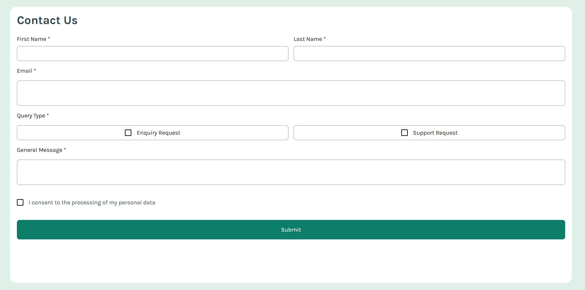
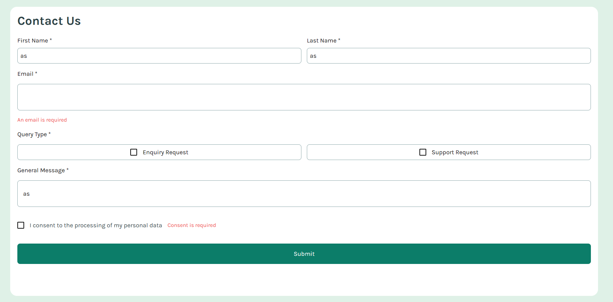
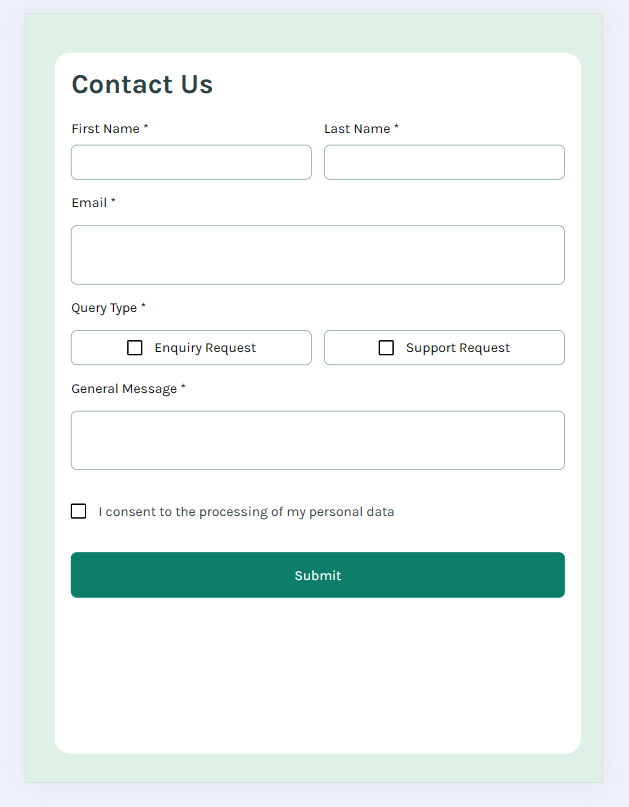
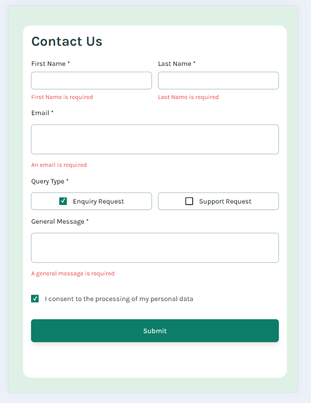

# Contact Form with Laura Dev

This project involved working on a contact form with ReactJS, Vite and TailwindCSS. Throughout the process, I worked on various key features such a useState hooks, reusable components such as an inputBox and styling with flexbox for all devices.

## Table of contents

- [Overview](#overview)
  - [Screenshots](#screenshots)
  - [Links](#links)
- [My process](#my-process)
  - [Built with](#built-with)
  - [What I learned](#what-i-learned)
  - [Continued development](#continued-development)
  - [Useful resources](#useful-resources)
- [Author](#author)

## Overview

Your challenge is to build out this contact form and make it look as close to the design as possible. Pay particular attention to making this form accessible. Building accessible forms is a key skill for front-end developers, so this is a perfect challenge to practice.

Users should be able to:

- Complete the form and see a success toast message upon successful submission
- Receive form validation messages if:
  - A required field has been missed
  - The email address is not formatted correctly
- Complete the form only using their keyboard
- Have inputs, error messages, and the success message announced on their screen reader
- View the optimal layout for the interface depending on their device's screen size
- See hover and focus states for all interactive elements on the page

## Screenshots

Desktop Version:

Mobile Version:

## Links

- Solution URL: [Add solution URL here](https://your-solution-url.com)
- Live Site URL: [Netlify Contact Form Laura Dev](https://contact-form-lauradev.netlify.app/)
- Github Repo: [Laura Dev Github Repo Contact Form](https://github.com/lavollmer/contact-form)

## My Process

This project began with the initial setup, which included creating a GitHub repository, initializing a Vite project with ReactJS, and integrating TailwindCSS. I configured TailwindCSS to incorporate the project's design specifications, such as fonts and colors. After ensuring the basic elements were operational through an initial commit, I proceeded to remove the default ReactJS template content to start with a clean slate.

I started this project by working through the design of the contact form with a reusable input box. I styled it with the design assets presented such as colors, Google Font and design itself. I worked through adding custom checkboxes and a submit button as well.

The second part was more challenging as I was working through the form validation of the contact form. This presented some challenges with props management, state management and onChange handlers. I was able to create useState hooks for each aspect of the form that would trigger if completed incorrectly showing a red text. Additionally, once each aspect of the form was completed then a success message would display.

After working through the above, I went back and worked through the finer details of the project. Some examples include, ensuring the text box inputs stretched the full width of the screen for design. Another example, was sizing the text to be appropriate for mobile versions while keeping the style for desktop versions. Furthermore, I updated the error messages and logic for each piece of the contact form. Overall, this project was great for learning and reinforcing form knowledge.

## Built with

- [React](https://reactjs.org/) - JS library
- Tailwind CSS
- Google Fonts
- Tailwind CSS Animation
- Semantic HTML5 markup
- CSS custom properties
- Flexbox
- CSS Grid
- Mobile-first workflow

## What I learned

Here are several things I learned throughout this project:

1. **_App.css Classes_** - I wanted an easy approach to designing the background of this application. I decided to do CSS in App.css and import it into App.jsx. This allowed me to cover the whole width and height of the screen with the light green color and format appropriately. I made a few mistakes such as wv (width view) should actually be vw(view width), etc.
2. **_Custom Checkbox_** - Custom checkboxes were used to match the specific design provided to replicate. In my CSS file, I was able to create a checkbox class that included width, height, background color, border and aligning text.
3. **_Form Validation_** - Form validation is a very important aspect of web design. I was able to refresh my memory on form validation and it's logic within JS.
4. **_Error Boundary_** - An error boundary is a component that catches JS errors in its child component. It handles errors and provides a way to recover form them.

## Continued development

I will continue to work on reinforcing ReactJS fundamentals while pushing my knowledge in ReactJS.

## Useful resources

- Family: [Karla](https://fonts.google.com/specimen/Karla)
- React Forms: [React Forms](https://react.dev/reference/react-dom/components/form)
- Form Labels for Accessibility: [Form Labels](https://dequeuniversity.com/rules/axe/4.9/label)

## Author

- Website - [Laura V](www.lauradeveloper.com)
- Frontend Mentor - [@lavollmer](https://www.frontendmentor.io/profile/lavollmer)
- Github - [@lavollmer](https://github.com/lavollmer)
